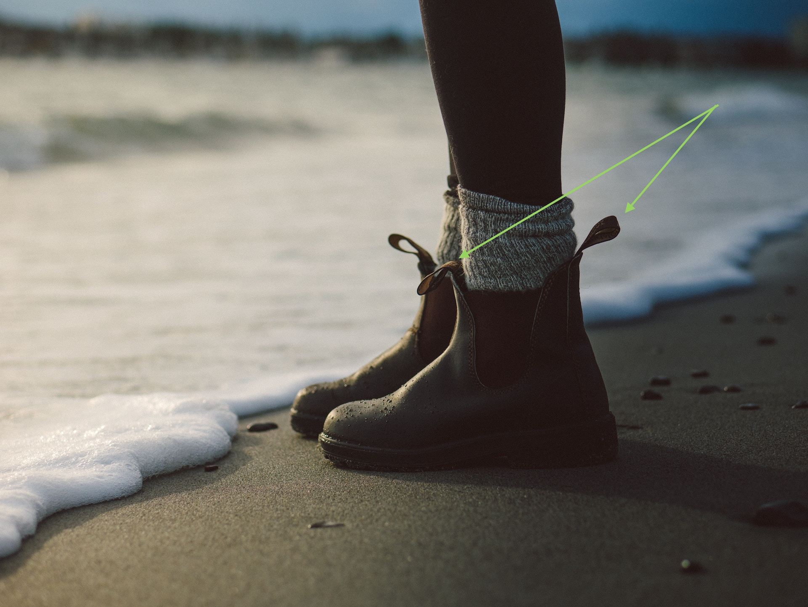
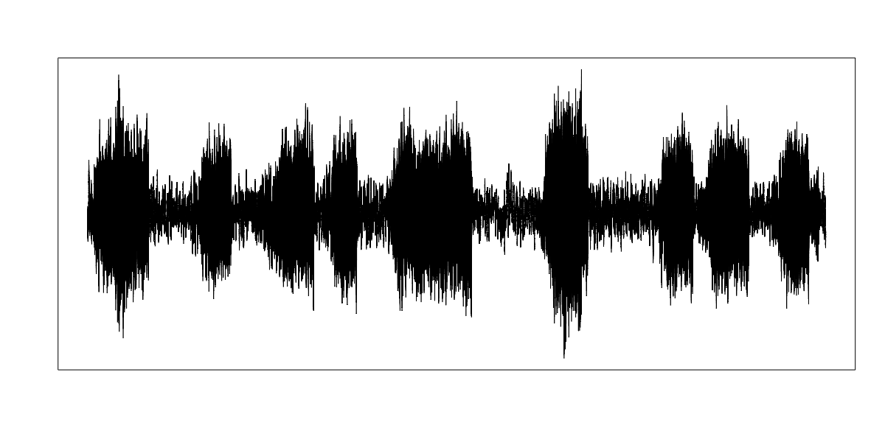
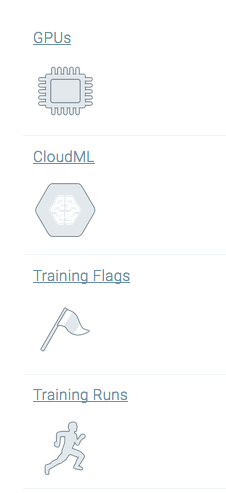
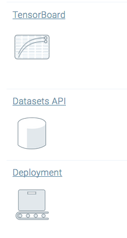
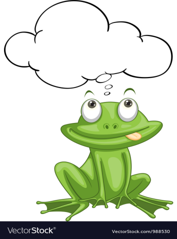
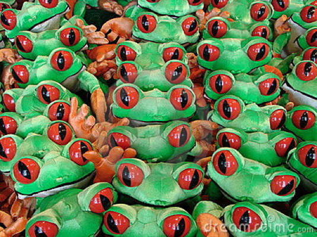

```{r setup, include=FALSE}
options(htmltools.dir.version = FALSE)
library(knitr)
library(kableExtra)
library(xaringanthemer)
```

```{r theme, include = FALSE}
# see https://github.com/gadenbuie/xaringanthemer
# and https://clrs.cc/ for beautiful colours

duo_accent(
  primary_color  = "#003a5a",
  secondary_color = "#c0ca33",
  header_color = "#3b6487",
  text_color = "#001430",
  text_bold_color = "#8c9900", 
  header_font_google = google_font("Josefin Sans"),
  text_font_google   = google_font("Montserrat", "300", "300i"),
  code_font_google   = google_font("Droid Mono"),
  table_row_even_background_color = lighten_color("#f5fd67", 0.6),
  text_font_size = "24px"
)

```

layout: true

.footer[Elizabeth Stark @tech_is_dead  &emsp;&emsp; symbolix.com.au  @SymbolixAU]


---

class: inverse, center, middle

# It started with a frog ...

---

background-image: url("images/Perons_Tree_Frog.jpg")
background-size: contain


???

---

background-image: url("images/map_2011-2016.png")
background-size: contain

???

# Actually ... lots of frogs

---

background-image: url("images/frog_census.jpg")
background-size: contain


---

class: inverse, center, middle

# The first challenge 


---

background-image: url("images/bootstrap_unsplash.jpg")
background-size: fill

# .lightsecondary[Solution:]

<!--  -->

???
Photo by Max Conrad on Unsplash
---


class: inverse, center, middle

# The second challenge

.image-5[[](sounds/SouthernToadlet.wav)] Southern Toadlet
.image-5[[](sounds/PeronsTreeFrog.wav)] Peron's Tree Frog
.image-5[[](sounds/GrowlingGrassFrog.wav)] GGF



---

class: center

# Computer listening vs computer vision


Keyword="sound"  : ~100K papers

Keyword="image"  : ~3.5Mil papers 


---

class: center, middle

# Solution:

## Play with the ~~cool kids toys~~ computer vision tools

---
background-image: url("images/callspectra.png")
background-size: contain

???

explain spectra


---


class: inverse, center

background-image: url("images/tags.jpg")
background-size: contain

# The third challenge

???

We have lots of data but not a lot of tagged data.  For time and money reasons we needed a POC to get more data....

---

# How few data?

* ~1,400 individual tagged calls

* 5 classes
  - Litoria fallax (Eastern Dwarf Tree frog)
  - Limnodynastes tasmanienses (Spotted grass frog)
  - Crinia signifera (Common Eastern froglet)
  - Limnodynastes peronii (Striped Marsh frog)
  - Other frog

### …… And about 100 million billion crickets calling over the top


---

class: right

background-image: url("images/underthehood.jpg")
background-size: cover

# Solution


 
???

Photo by Hosea Georgeson on Unsplash
 
---

class: inverse, center, middle

# Our toolbox
 
 
---

background-image: url("images/rstudio-training-metrics-full.gif")
background-size: contain


---

class: center

# With all the usual tools




---

class: inverse, center, middle

# Tricks and tips

---

class: middle, center

## Leave the deepest networks for the big datasets

---

background-image: url("images/inside_alexnet.png")
background-size: contain


???

https://medium.com/nanonets/nanonets-how-to-use-deep-learning-when-you-have-limited-data-f68c0b512cab


---

class: middle, center

# Even it out


---


background-image: url("images/froggroups.jpg")
background-size: contain


---

class: middle

# Data augmentation 

* Normalise/standardise
* Rotate
* Shift/Jitter
* Shear
* Zoom
* Flip


---

class: right

background-image: url("images/rotation.png")
background-size: contain

# Rotation

---

background-image: url("images/shift.png")
background-size: contain
background-position: bottom

# Shift

---

class: middle, center

# Sometimes you need the big guns

---

background-image: url("images/maths.jpg")
background-size: contain


---


class: inverse, center, middle

# The result?


???

## Worked better than it had any right to!


---

background-image: url("images/trainingrun.png")
background-size: contain


---

class: center

# Next steps


.image-30[ ] 
.image-30[ ]
.image-30[ ]


---


background-image: url("images/aboutus.jpg")
background-size: cover
