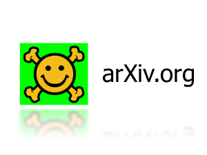

```{r setup, include=FALSE}
options(htmltools.dir.version = FALSE)
library(knitr)
library(kableExtra)
library(xaringanthemer)
```

```{r theme, include = FALSE}
# see https://github.com/gadenbuie/xaringanthemer
# and https://clrs.cc/ for beautiful colours

duo_accent(
  primary_color  = "#003a5a",
  secondary_color = "#c0ca33",
  header_color = "#3b6487",
  text_color = "#001430",
  text_bold_color = "#8c9900", 
  header_font_google = google_font("Josefin Sans"),
  text_font_google   = google_font("Montserrat", "300", "300i"),
  code_font_google   = google_font("Droid Mono"),
  table_row_even_background_color = lighten_color("#f5fd67", 0.6)
)

```

layout: true

.footer[Elizabeth Stark @tech_is_dead  &emsp;&emsp; symbolix.com.au  @SymbolixAU]

---


background-image: url("images/aboutus.jpg")
background-size: contain

???

We do:

* AI/machine learning and datascience
* stats and consulting

We work in 

* transport and urban networks
* Environmental managment
* Organisations 

We are avid open source advocates

---

class: inverse, center, middle

# It started with a frog ...

---

background-image: url("images/Perons_Tree_Frog.jpg")
background-size: contain


???

---

background-image: url("images/map_2011-2016.png")
background-size: contain

???

# Actually ... lots of frogs


---

# The first challenge

.image-5[[](sounds/SouthernToadlet.wav)] Southern Toadlet
.image-5[[](sounds/PeronsTreeFrog.wav)] Peron's Tree Frog
.image-5[[](sounds/GrowlingGrassFrog.wav)] GGF

---

class: center

# Computer listening vs computer vision


.pull-left[


Keyword="sound"  : ~100K papers 
Keyword="image"  : ~3.5Mil papers 
]

.pull-right[

]


---

class: inverse, center, middle

# Play with the ~~cool kids toys~~ computer vision tools

---

# Pipeline to convert sound -> images

---

# The second challenge

Not enough data


---

# The third challenge MONEY

---

Pre-trained models ? No

Transfer learning...? Maybe

Careful control to stop overfitting ? Defininitely!

---

class: inverse, center, middle

# Time to dive into the tools

---

# Data augmentation

---

# Roll your own

---

# Deeper may not be better


---
